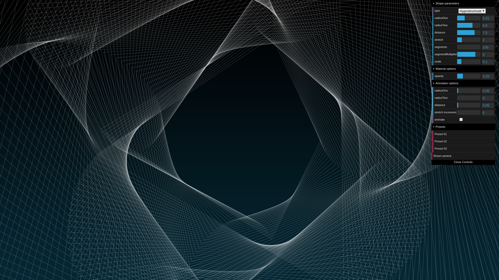

# Three.js Hypotrochoid/Epitrochoid Visualizer 

This is a small Typescript project that utilizes the [Three.js](https://threejs.org/) JavaScript-based library to visualize roulette curves called [Epitrochoid](https://en.wikipedia.org/wiki/Epitrochoid) and [Hypotrochoid](https://en.wikipedia.org/wiki/Hypotrochoid) curves. These types of curves are especially known because of the [Spirograph](https://en.wikipedia.org/wiki/Spirograph) toy, which draws Hypotrochoid curves.

## Preview



**Note:** A live preview is also available at: [This location](https://nicklas.xyz/lab/hypotrochoidepitrochoidvisualizer/)

# Dependencies

To be able to compile and run the code locally in the browser, the following things are needed:

- [Node.js](https://nodejs.org/en/): A package manager for Node.js packages. Through this package manager all other dependencies can be installed automatically (see how in the next section: [](#usage)). The dependencies that, most importantly, should be installed are the following: 
  - [Three.js](https://threejs.org/): A library that uses WebGL and provides an API for creating and and displaying animated computer graphics in a web browser.
  - [Webpack](https://webpack.js.org/): A library that is able to bundle all dependencies into static assets, which can then easily be included into a static website.
  - [dat.GUI](https://github.com/dataarts/dat.gui): A lightweight library for changing variables through a graphical user interface.

# Usage

**Installing all dependencies:**

1. Through the terminal clone this repository to a certain directory and navigate to it:
   ```
   git clone https://github.com/nicklasxyz/EpitrochoidHypotrochoidVisualizer && \
   cd EpitrochoidHypotrochoidVisualizer 
   ```
2. Install all dependensies needed for the application to run:
   ```
   npm install
   ```

**Serving the website locally:**

1. Through the terminal, serve the website by running:
   ```
   npm run dev
   ```
2. Finally, navigate to the address through a web browser: [`http://localhost:8000/web`](http://localhost:8000/web).


**Building the website:**

1. Through the terminal, simply run:
   ```
   npm run build
   ```
2. The folder named `web` should now contain all the static assets.